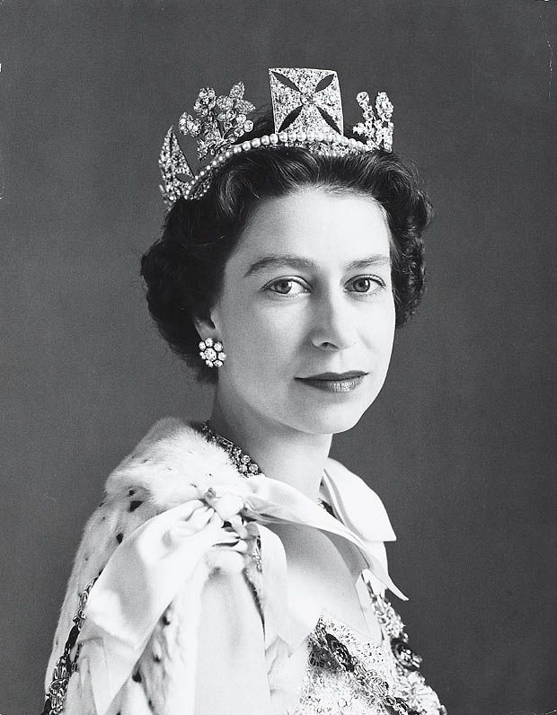

London, England
===============

Visiting London? Want to know more about London?

Here's a few things to know before you go.

Queen Elizabeth II
------------------

Queen Elizabeth II serves as the main point of national identity in the United 
Kingdom. She took the throne in 1952 at age 25 following the death of her 
father, George VI. She began her reign as one of the youngest monarchs ever and 
has outlasted almost every other world leader. 

	Queen Elizabeth II, age 25.

After 67 years of leadership, the queen is now 92 and has redefined what it 
means to be a monarch. 

Once the queen passes and is no longer able to rule, there is a long list, in 
order, of people who would be eligible to take the throne. 

The top 6 eligible suiters for the throne:

==================  ==================================================
Name                Relation to the throne
==================  ==================================================
Prince Charles      Eldest child of Queen ELizabeth II
Prince Williams     Eldest son of Prince Charles and Princess Diana
Prince George		Eldest son of Prince William and Catherine
Princess Charlotte  Daughter of PRince William and Catherine
Prince Louis        Third child of Prince William and Catherine 
Prince Harry		Second son of Prince Charles and Princess Diana
==================  ==================================================

For more information about all things royal, visit the `Royal Website`_.

.. _Royal Website: https://www.royal.uk/

Tourist Attractions
-------------------

Anyone could spend *months* traveling around London and visiting all of the 
castles and attractions and immersing yourself in British history and culture.  

Here are a few of the most popular tourist attractions:

.. Figure:: bigben.png
	:width: 50%

	Tower Clock

* Tower Clock A.K.A **Big Ben**
	
	* Clock was designed by Edmund Beckett Dension.
	* Famous for its *colossal* bell, measuring out at 7 feet tall, 9 feet wide
	  and weighing 15.1 tons. 
	* There is an ongoing debate over why the Tower Clock was given its nick-
	  name, **Big Ben**. 
	* Some believe it was named after the English Heavyweight Champion, Benjamin
	  Caunt.
	* Others believe it was named after Sir Benjamin Hall who oversaw the 
	  installation of the Bell. 

.. Figure:: buckingham.png
	:width: 50%

	Buckingham Palace

* **Buckingham Palace**
    
    * The palace got it's name when it was built in 1705 for John Sheffield,
      Duke of Buckingham.
    * In 1762, it was bought by George III for his wife, Queen Charlotte.
    * Now, the palace is known as the Queens house. 
    * The Queen is currently hiring a new `gardener`_ at **Buckingham Palace**.
    
    .. _gardener: https://www.birminghammail.co.uk/news/uk-news/queen-hiring-new-gardener-buckingham-16154435

.. Figure:: trafalgar_square.jpg
	:width: 50%

	Trafalgar Square

* **Trafalgar Square**

	* This is the most popular square in London and is located in Westminster.
	* The plaza is named for Lord Nelson's naval victory in the Battle of
	  Trafalgar in 1805.
	* In the month of December, people gather around a giant tree, donated by 
	  Norway, and sing Christmas carols. 

Public Transportation
---------------------

No need to rent a car when traveling in/through London.The public 
transportation system in London is *fantastic*. There isn't anywhere 
you can't go, and for a good price. 

Almost everyone uses some form of public transportation in London because it is
easy and cheap.

.. Image:: public_transportation.jpg
	:width: 50%

* Underground A.K.A "The Tube"
* Overground
* Docklands Light Railway
* Rail services
* Bus
* Tram
* Emirates Air lines
* River boat
* Taxi
* Bicycles 
* Walking  